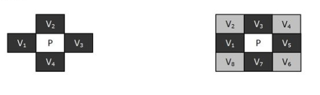
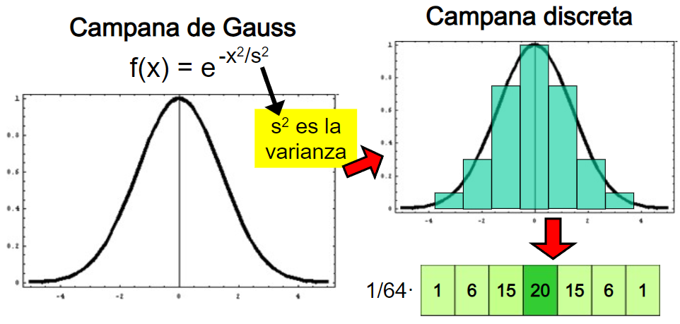
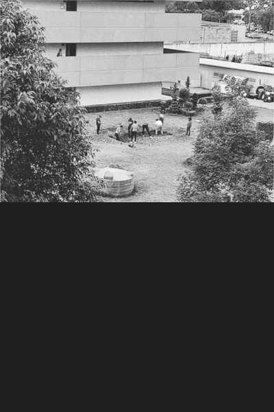
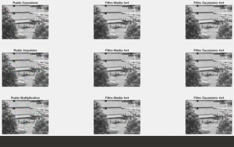
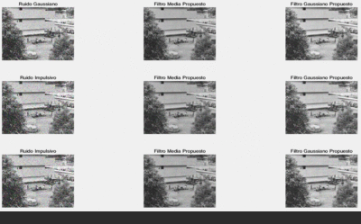

# Introducción 📖
Se propone realizar un programa que pueda usar conectividad 4 y proponer una máscara propia del mismo tipo de conectividad; comparar los resultados con el filtro de la media y el filtro gaussiano, pero antes de comenzar:

## ¿Qué es el procesamiento digital de imagenes (PDI)? 🤷‍♂️🤷‍
PDI se puede definir como el conjunto de procesamientos que se realizan sobre una imagen digital ya sea para realizar su almacenamiento, transmisión o tratamiento.

## Lectura de imágenes en matlab 👓
Para leer una imágen en matlab se utiliza la función <a href="https://la.mathworks.com/help/matlab/ref/imread.html"> **imread**</a> y se asigna a una variable que representara a la imágen.

<h5 align="center"><code>imagen = imread('ruta/nombre de la imágen.extensión');</code></h5>

## VECINDARIO DEL PIXEL 🏙
Algo que tiene mucho peso en las imágenes es el concepto de **conectividad**. Hay muchas operaciones en el procesamiento de imágenes que utilizan un área, llamada área de influencia para tratar un solo pixel.

Se consideran diferentes tipos de conectividad, por ejemplo conectividad 4 o conectividad 8, donde se consideran los pixeles conectados en diagonal.

* Conectividad 4: Se consideran N,W,E,S
* Conectividad 8: Se consideran N,W,E,S,NW,NE,SE,SW

## FILTROS ESPACIALES 👩‍🚀👩‍🚀
El empleo de máscaras para el procesamiento de las imágenes se denomina frecuentemente filtrado espacial y las máscaras se denominan filtros espaciales.

Podemos clasificarlos en:
* Filtros suavisantes
* Filtros resaltantes

### FILTROS SUAVISANTES 🎛🎛
Estos filtros se emplean para reducir ruido, pero dejan la imagen un poco borrosa.

Hay filtros suavisantes **lineales y no lineales**

#### Filtros lineales
En los filtros espaciales, el valor del filtro en un pixel está determinado como una combinación lineal de los valores de los pixeles vecinos.

En este tipo de filtros se realiza una operación de convolución entre la imagen a ser filtrada y una máscara.

El principal inconveniente de estas técnicas es el enturbiamiento que se produce en la imagen, provocando bordes difuminados, por lo que tienen que ser utilizados con precaución.

Los más usados son: **filtro de la media y filtro gaussiano**

##### Filtro de la media
Este filtro es quizá el más sencillo de los filtros lineales.

Les da pesos iguales a todos los pixeles en el vecindario para reducir la cantidad de variaciones de intensidad entre pixeles vecinos.

* Nota.- Cada pixel se remplaza por la media de los pixeles vecinos

1 | 1 | 1
-------|--------|--------
1 | 1 | 1
1 | 1 | 1

En Matlab la función que permite realizar un filtro de la media es <a>**imfilter**</a>

<h5 align="center"><code>imfiltrada=imfilter(A,H,option1,option2,...)</code></h5>

Esta función filtra la imagen A con el filtro multidimensional H, los parámetros option1, option2, ..., son opciones de frontera, de tamaño de la imagen de salida y opciones de correlación o convolución.

La función de Matlab que me permite generar el filtro H es: <a>**fspecial**</a>

<h5 align="center"><code>H=fspecial(type,parametros)</code></h5>

La función <a>**fspecial**</a> crea filtros bidimensionales del tipo especificado por type (filtro gaussiano, un detector de bordes de sobel, un operador laplaciano, un filtro de la media, ...)

Los parámetros dependen del tipo de filtro

~~~
close all;
clear all;
im = imread('cerezo','jpg');
imshow(im);title('original');

imn=imnoise(im,'gaussian');
figure()
imshow(imn);tilte('Gaussiano');

media=fspecial('average');%ventana 3x3
imfilt=imfilter(imn,media);
figure()
imshow(imfilt);title('filtro de media 3x3');

media=fspecial('average',[9,9]);%ventana 9x9
imfilt=imfilter(imn,media);
figure()
imshow(imfilt);title('filtro de media 9x9');
~~~

##### Filtro gaussiano
Este filtro tiene una media ponderada, los pesos de la matriz toman la forma de la campana de Gauss.

La varianza, indica el nivel de suavizado:
* Varianza grande: Campana más ancha, mayor suavizado
* Varianza pequeña: Campana más estrecha, menor suavizado

<h5 align="center"><code>ImagenFiltrada=fspecial('gaussian',tamaño del filtro, sigma);</code></h5>

* Tamaño del filtro: Es un vector que especifica el número de filas o columnas, por default el filtro es de 3x3
* Sigma ($\sigma$): Es la desviación estandar, por default es de 0.5

0.0113 | 0.0838 | 0.0113
-------|--------|--------
0.0838 | 0.6193 | 0.0838
0.0113 | 0.0838 | 0.0113

Máscara de filtro Gaussiano de 3x3 con sigma de 0.5

* Nota.- La mascara de este filtro depende del valor de sigma, por eso no existe una mascara por defecto como tal
* Nota.- Las mascaras modifican el valor del centro de la imagen donde se coloca dicha mascara (la mascara no se modifica)

#### Resultados
Se usaron las siguientes imagenes para esta practica:

A cada una de las imagenesse le añadio Ruido Gaussiano, impulsivo y multiplicativo; primero se usaron los filtros de la media y Gaussiano (4x4) que ofrece por defecto Matlab, dando los siguientes resultados:

Posteriormente se propusieron los siguientes filtros; para el de la media se propuso la siguiente matriz

1.5 | 1 | 1 | 1.5
----|--------|--------|--------
1 | 1 | 1 | 1
1 | 1 | 1 | 1
1.5 | 1 | 1 | 1.5

Mientras que para el filtro Gaussiano se uso una $\sigma$ = 1.1 con una $\mu$=2 obteniendo la siguiente matriz

0.0088 | 0.0695 | 0.0695 | 0.0088
--|--|--|--
0.0695 | 0.2399 | 0.2399 | 0.0695
0.0695 | 0.2399 | 0.2399 | 0.0695
0.0088 | 0.0695 | 0.0695 | 0.0088

A continuación se muestran los resutados obtenidos

<a href="https://github.com/ArturoEmmanuelToledoAguado/Img_Filtro/blob/main/Img_Filtro.m">Código</a>
